## Hello, World! 👋

👋 Olá! Sou Humberto, Bacharel em Engenharia da Computação pelo CIn-UFPE e atualmente Engenheiro de Dados na Extreme Digital Solutions (EDS), onde contribuo para o desenvolvimento e manutenção de soluções de dados eficientes e sustentáveis, com foco em otimização de processos e geração de valor.

 
  
  
  
  
       
  
  

##

  
   

##

<!--

-->
